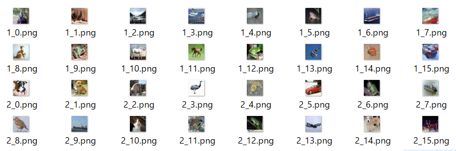

# Extended_ImageDataGenerator_Sample
## Tensorflow Keras API ImageDataGeneratorを拡張し、自作のノイズ付与機能を追加したサンプル 
Tensorflow 2.1 + Python3.7にて動作確認  

# 使い方
`python train_with_ExtImageDatagenerator.py`  
CIFAR10データセットで学習を開始し、収束したらテスト結果を表示します。

また、debugフォルダに、学習初期の画像を何バッチか保存します。  
(現在どういう画像が学習されているかの確認用)

# オプション
22行目 `USE_EXT_GENERATOR = True` をFalseにすることで、  
Augumentationなしの学習を行います。  
(精度比較用)

# 評価結果
* ExtImageDataGeneratorによる HFlip + ChannelShift + AddNoise実施 学習結果  
loss:0.772628215932846  
acc :0.7592999935150146  

* ImageDataGeneratorによる HFlip + ChannelShift実施 学習結果  
loss:0.7938857310771942  
acc :0.7570000290870667  

* ImageDataGeneratorでAugmentなし学習結果  
loss:1.076167423915863  
acc :0.7027000188827515  

# 学習途中画像サンプル
分かりにくいですが、学習画像の半数にはノイズが乗っています。

